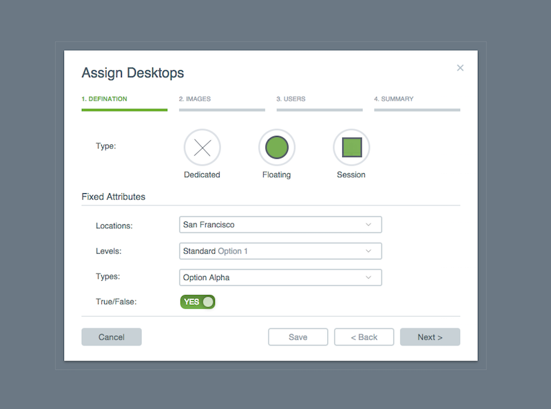
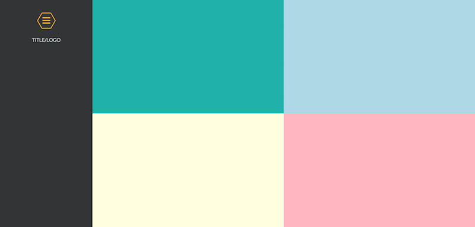
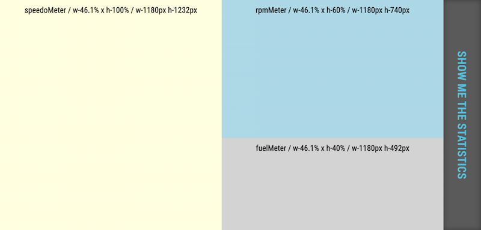
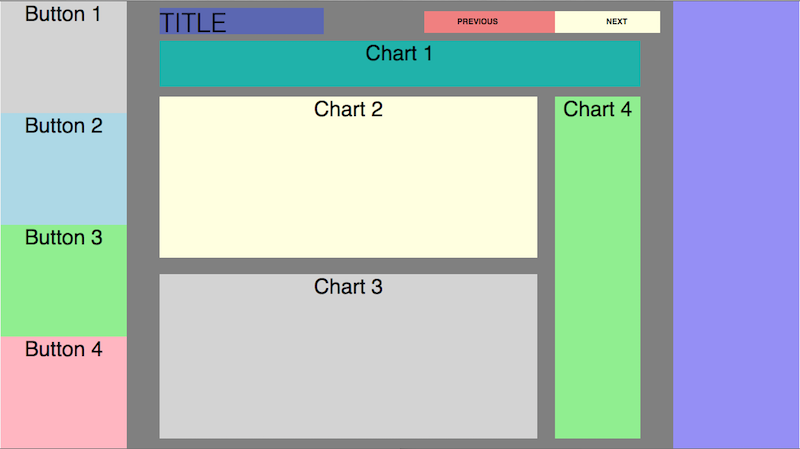

# InteractivePrototypes
Interactive Prototypes of mockup and wireframes

---
All prototype is developed using Modalbox using CSS, HTML and Jquery. 

###Prototype of Signup modal window

###Prototype_1 design

###Prototype_2 design

###Prototype_3 design

Soon update it with tep by step development notes. 